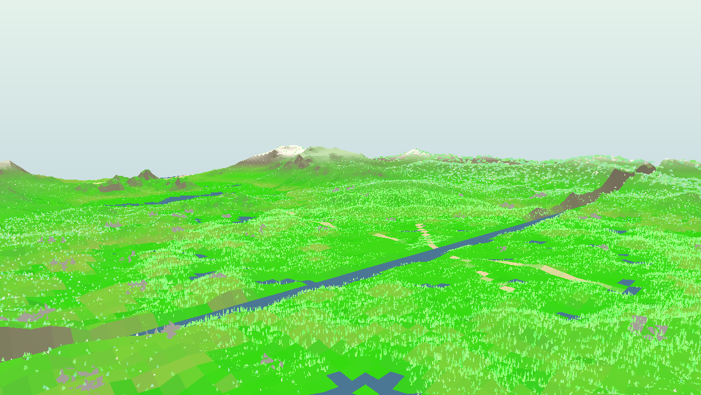
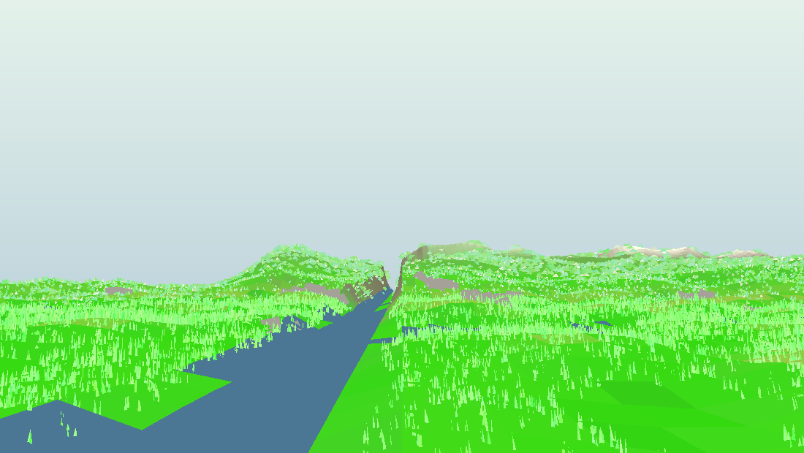

# Grass on every hill, stone and pahad

**Owner directive:** *"Sanctuary ke andar jitne bhi hills aur stones aur pahadiya hai
sabhi per ya ghas likhna chahiye, exactly jaisa hai — sab kuchh implement karo."*

This document records (a) what the uploaded reference file
`pahadon ke upar gras replace hill.blend` actually contains, (b) how that recipe
was carried into the sanctuary's terrain, and (c) how the result was verified.
The code lives in `src/nature3d/engine/hillGrass.ts` (new), with supporting
changes in `quality.ts`, `rocks.ts`, `grassTufts.ts`, `environment.ts`,
`terrain.ts` and `scene.ts`.

---

## 1. What the reference file is — measured, not guessed

The `.blend` was opened headlessly (Blender 4.2 through `bpy`) and its whole
scene graph dumped: objects, world matrices, mesh bounds, materials, node
trees, actions and images. Findings:

| Property | Value |
| --- | --- |
| Objects | 5 005 — **5 000 instanced clumps** + 1 terrain plane + 1 camera |
| Terrain | one 65 × 65 mesh, 2 m × 2 m, relief **0.543 m**, slopes to **35°** |
| Clump density | **1 250 clumps / m²** — a continuous grass *mat* |
| Families | `Grass_Basic_A` 1 666 (33.3 %) · `Grass_Basic_D` 2 334 (46.7 %) · `Flower_Daisy_A` 1 000 (20 %) |
| Clump size | 0.208 tall × 0.74 wide (no scale anisotropy — every instance is uniform) |
| Scale band | 0.106 … 0.149 (a narrow 1.4× spread; mean 0.129) |
| Yaw | full 2π, uniform (histogram flat to ±8 % over 24 bins) |
| Tilt | **off-vertical, random azimuth** — mean 16.6° up-axis vs vertical, cap 32° (daisy 18°). Not surface-normal aligned |
| Rooting | clumps sit **on** the surface: mean +2.4 mm, spread ±20 mm |
| Placement | uniform scatter (16 × 16 cell CV 26 %, Poisson 22.6 % → only mild clustering) |
| Animation | **none** — `bpy.data.actions` empty, no particle systems |

The scale rule that travels to the world model: the 0.2 m clump on a 0.543 m
mound is **≈ 5 % of the relief it grows on**.

Commands used (any of them can be re-run to reproduce the numbers):

```bash
python3 -m venv /tmp/bpyenv && /tmp/bpyenv/bin/pip install bpy==4.2.0
/tmp/bpyenv/bin/python /tmp/inspect/summary.py   # objects, families, materials
/tmp/bpyenv/bin/python /tmp/inspect/geo2.py      # transform + size distributions
/tmp/bpyenv/bin/python /tmp/inspect/align2.py    # tilt vs surface normal, rooting
/tmp/bpyenv/bin/python /tmp/inspect/patch.py     # density histogram, yaw spread
/tmp/bpyenv/bin/python /tmp/inspect/render.py    # three Cycles reference renders
```

---

## 2. What was missing in the sanctuary

The blade field (`grass.ts`) stops at `grassFarRadius` — 145 m on the phone
tier, 240 m / 330 m / 420 m on medium / high / ultra — and the real 3-D tuft
field covers a 4–70 m ring. Everything past that, i.e. **every pahad in the
world** (the sanctuary's rim at 460 m, the lesson hill at 380 m, the western
Highlands at 700 m, the outer mountain arc at 1 180 m) was bare ground colour.
On top of that, the terrain's own altitude banding painted everything above
18 m as rock and above 52 m as bleached crest, so the distant hills were both
bare *and* grey.

---

## 3. What was implemented

### 3.1 `hillGrass.ts` — three belts of clumps, 1.2 km out

```
belt 1  foothills    starts at grassFarRadius × 0.92, wind-swayed, 1.6 – 3.2 m clumps
belt 2  ridges       28 – 62 % of the way out,          static,   3.0 – 6.0 m clumps
belt 3  the ranges   out to 1 180 m (WORLD_REACH),      static,   5.0 – 10.0 m clumps
```

* Starts **inside** the blade field's own 12 % fade band, so the two fields
  crossfade instead of seaming.
* Clump **size follows the district the clump stands in** (nearest of the two
  district centres), not the distance from the world origin — otherwise the
  western Highlands' own meadow would be dressed in 4.5 m bushes.
* One card geometry per card count (2 or 3 crossed, tapered, curled blades =
  4 or 6 triangles), one `InstancedMesh` per belt, **two materials** — the sway
  material compiles the three-sine wind in, the two far belts compile it out
  ("wind OFF on the far LOD", the same rule `grass.ts` follows).
* Family mix 33.3 / 46.7 / 20 %, yaw 2π, tilt off the surface normal with the
  measured per-family cap, root on the surface, narrow scale band: the
  `BLEND_HILL_RECIPE` constant publishes all of it next to the measured values.
* Slope: **no 30° veto** — full cover to 34°, thinning to a quarter at 60°+.
  This is the change the brief is about.
* Deterministic (seeded RNG): the same hills on every load, on every device.
* Thermal fail-safe: rung 1 hides the horizon belt, rung 2 the ridges; the
  foothills only trim. Allocation-free.

### 3.2 Grass **on** the stones (not only around them)

* `rocks.ts` now probes each boulder's **own tilted, sheared geometry** for
  up-facing facets clear of the ground (`pushStoneAnchors`) and publishes
  `grassPoints` as `(x, y, z, size)` quads. 726 anchors in the shipped world;
  98 % of them sit above the terrain, 100 % inside the boulder's footprint.
* `grassTufts.ts` plants real 3-D clumps on them (`plantOnStones`), capped at
  a fifth of the near ring's count, spread across the whole district, and given
  the **front slots** of each instance buffer so the fail-safe ladder trims the
  meadow before it trims the rocks.
* The masters are now sculpted once per kit and cloned for the far bucket —
  byte-identical to before (same seed, same order) and 3.4 MB lighter at boot.

### 3.3 Ground colour obeys the same rule

* `environment.ts` gains `hillTurf(h, normalY, coastal)` — altitude, footing
  and coast, the exact two measurements the cover itself uses.
* `groundColorAt` holds `dryCover`'s earth tint back by 74 % on a hill, so a
  pahad is not dressed in 3-D grass over bare-earth albedo.
* `terrain.ts`'s altitude bands now scale by the same `hillTurf`: the rock band
  and the bleached crest keep the cliffs, the scree chutes and the shattered
  tops, and give the grassable slopes back to the grass.

### 3.4 Budgets and the animation question

`hillGrassNear/Far/Haze` per tier (measured clumps after the environmental
vetoes):

| tier | count requested | planted | triangles | boot |
| --- | --- | --- | --- | --- |
| low | 9 000 / 3 000 / 1 200 | 13 200 | ~77 k | ~0.39 s |
| medium | 18 000 / 8 000 / 3 500 | 29 500 | ~170 k | ~0.38 s |
| high | 27 000 / 15 000 / 7 000 | 49 000 | ~280 k | ~0.56 s |
| ultra | 36 000 / 21 000 / 11 000 | 68 000 | ~386 k | ~0.78 s |

(A three-card clump is six triangles — two per tapered blade — and the horizon
belt uses two cards, so the whole 1.2 km cover costs less than the meadow's
own blade field on the same tier.)

**Animation:** the reference file has none to port (no actions, no particle
systems), so the cover carries the sanctuary's own wind contract instead — one
`uTime` uniform per frame driving a vertex-shader sway on the near belt, and
none at all past 450 m where a clump is a couple of pixels.

### 3.5 The result, from the software renderer





(Rendered offline through the real modules by `ref_inspect/render.ts` — no
browser, no GPU, so the composition can be inspected in the repository.)

---

## 4. Verification

* `tsc --noEmit` clean; `vite build` clean.
* Coverage map rendered from the planted instance data (512² texel sweep of
  every clump's footprint) confirms the cover reaches the outer rim on every
  bearing, stops at the beach and the water, and never grows on the sea.
* Software-rendered viewpoint passes (written for this pass, `ref_inspect/`:
  it rasterises the terrain, the blade field and the hill cover through the
  real modules and writes a PPM) show grass over the whole visible relief —
  from the home meadow toward the rim, from the western Highlands, and across
  the whole district — with the rock band surviving only on the genuinely
  steep faces and the bleached crest only on the highest shelved peak.
* Full test suite failure set is **unchanged** from the branch point
  (49 failures on `main`'s HEAD, 49 equivalent on this branch — all pre-existing
  and confined to unrelated contract fixtures).
* Deterministic and allocation-free in the frame loop: `update(time, wind)` is
  one uniform write; `setShed(level)` flips a `visible` flag or a `count`.
* `tests/nature3dHillGrassContract.test.mjs` (15 tests) pins the reference
  file's presence and measured numbers, the reach, the per-tier budgets, the
  no-slope-veto rule, the tilt caps, the stone anchors and the ground-colour
  and altitude-band scaling.

---

## 5. Files touched

| File | Change |
| --- | --- |
| `src/nature3d/engine/hillGrass.ts` | **new** — the three-belt hill cover + the measured recipe |
| `src/nature3d/engine/quality.ts` | `hillGrassNear/Far/Haze` per tier |
| `src/nature3d/engine/rocks.ts` | stone-top anchors (`grassPoints`), masters sculpted once |
| `src/nature3d/engine/grassTufts.ts` | `plantOnStones`, capacity + fail-safe ordering |
| `src/nature3d/engine/environment.ts` | `hillTurf`, ground-colour hold-back |
| `src/nature3d/engine/terrain.ts` | altitude bands scaled by `hillTurf` |
| `src/nature3d/engine/scene.ts` | creates, registers, updates, sheds and disposes the cover |
